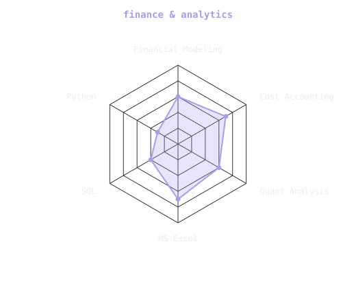
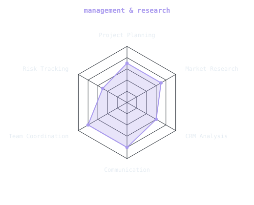
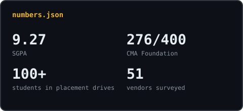

 

 

&nbsp;&nbsp;
&nbsp;&nbsp;

 

---

## This is me :)

Hi, I'm **Swayam**, a B.Com student in Pune aiming for a management role in finance after graduating in 2027.

- 🎓 **B.Com (3rd Year) at Indira College of Commerce and Science, Pune University**: SGPA 9.27.
- 🏅 **CMA Foundation qualified** with distinction (276/400) and exemptions in all 4 papers.
- 💼 **HR & Market Research Intern at BIIOS Startup Consulting LLP** (6 July 2026 to 6 September 2026): market research, go-to-market analysis and website audits for client brands.
- 🧭 **Placement Coordinator**, running drives for 100+ students across 30+ companies.
- 🧑‍💻 Honestly, I only know how to vibe code. But I like learning new things, and right now coding is the new thing I'm getting my hands on.

 

## my stack

 

---

## signals

<table>
<tr>
<td width="50%" align="center" valign="middle">

<picture>
  <source media="(prefers-color-scheme: dark)"  srcset="assets/radar-finance-dark.svg">
  <source media="(prefers-color-scheme: light)" srcset="assets/radar-finance-light.svg">
  
</picture>

</td>
<td width="50%" align="center" valign="middle">

<picture>
  <source media="(prefers-color-scheme: dark)"  srcset="assets/radar-management-dark.svg">
  <source media="(prefers-color-scheme: light)" srcset="assets/radar-management-light.svg">
  
</picture>

</td>
</tr>
</table>

---

## recent work

- 📊 **Impact of Digital Payments on Street Vendors**: field survey across 9 locations and 51 vendors, compiled into a 33-page report on UPI adoption and financial inclusion.
- 📑 **SMEs and Ind AS 10 Compliance Study**: analyzed PP&E reporting gaps in SME financial disclosures.
- 🧴 **CRM Analysis, Cetaphil vs. CeraVe**: competitive analysis of customer relationship strategies across two skincare brands.

## certifications & simulations

Project Management (Google) · Finance & Quantitative Modeling (UPenn) · Deloitte IFRS · Google Digital Marketing

Forage virtual experience programs: Citi (Investment Banking), Deloitte Australia (Data Analytics & Cyber), Goldman Sachs (Operations & Risk), Siemens (Project Management)

---

## numbers matter? ohhh yes.

<picture>
  <source media="(prefers-color-scheme: dark)"  srcset="assets/card-numbers-dark.svg">
  <source media="(prefers-color-scheme: light)" srcset="assets/card-numbers-light.svg">
  
</picture>

---

built with curiosity · swayamagrawal17@gmail.com

